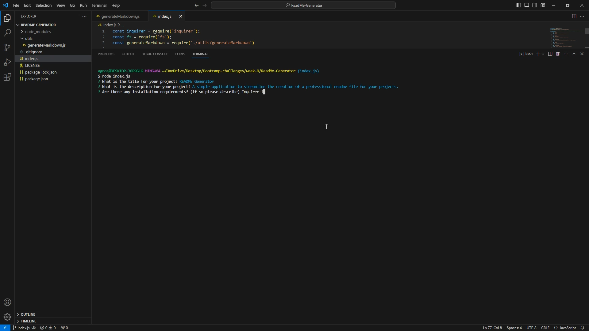

# README Generator

# Description
A simple application to streamline the creation of a professional readme file for your projects.

# Table of Contents
* [Installation](#installation)
* [Usage](#usage)
* [License](#license)
* [Contributing](#contributing)
* [Tests](#tests)
* [Questions](#questions)

# Installation
Inquirer is required. It is included in this repo

# Usage
Clone this repo. Then in your terminal run "npm i" to install Inquirer. Once Inquirer has been installed, run "node index.js" to start the application. Follow the prompts on your screen to build your README file

Walkthrough of running the application and filling out the prompts:
()https://drive.google.com/file/d/1FkRFkoGeTgw_duJQv5ILP6dVKaMZrpfJ/view?usp=sharing

# License 
This application is covered under the following license:

# Contributing 
Currently not taking any contributions to this project.

# Tests
n/a

# Questions 
* GitHub Username: https://github.com/GrossmannA
* Any additional questions can be received at: agrossmann315@gmail.com

